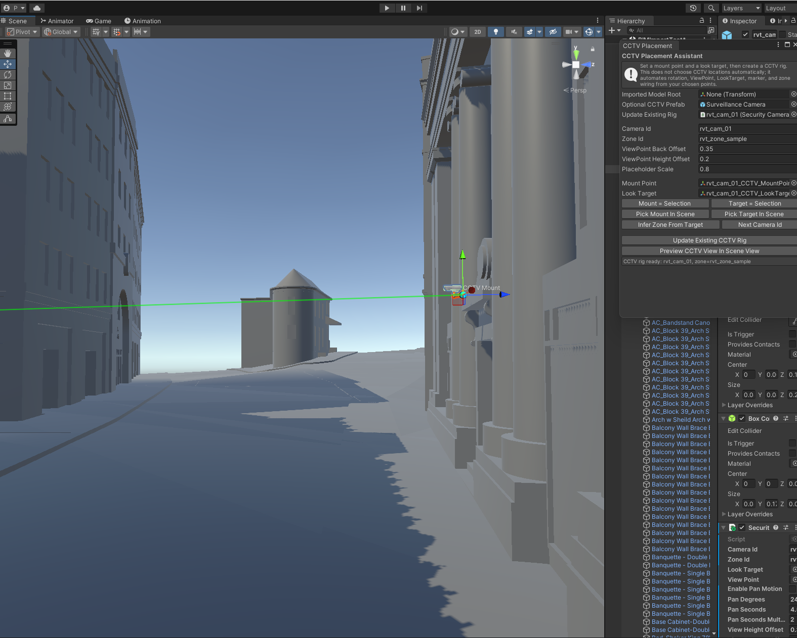

# BogoBogo Unity Virtual Map Simulator Portfolio

BogoBogo is a capstone prototype for industrial security incident monitoring. This portfolio repository is organized around my Unity simulator work: a Virtual Map that receives backend incident events, highlights CCTV locations, switches into CCTV viewpoints, and plays spatial security scenarios for demo recording.

The dashboard code is included only as supporting context for how the simulator was connected to incident state. The main portfolio value is the Unity Virtual Map simulator, its CCTV interaction model, backend WebSocket listener, scenario controller, and BIM/CAD-based placement automation experiment.

This public version is intentionally curated. It does not include private API keys, database credentials, original Unity Asset Store packages, raw evidence videos, WebGL or Standalone build outputs, Revit/IFC source models, or team-private backend configuration.

## What This Repository Shows

- Unity Virtual Map simulator scripts for CCTV markers, CCTV view switching, 4-camera panel view, scenario playback, robot/drone/camera control, and backend WebSocket event handling.
- Security scenario controllers for fence climbing, fence damage, facility filming, and facility damage demo flows.
- BIM/CAD extension prototype scripts for semi-automated CCTV placement, BIM metadata review, zone anchors, and audit output.
- Dashboard-to-Unity state mapping and fallback factory map components as integration context.
- Architecture and security notes explaining the simulator role, source-of-truth boundary, and public-release exclusions.

## Simulator Highlights

- **Backend WebSocket listener**: Unity listens to backend incident events and reacts to `camera_id` and `status`.
- **CCTV marker system**: each camera has a marker state, detected/reviewed ring emphasis, and click-based CCTV view entry.
- **CCTV view mode**: the operator can enter a selected CCTV view and return to the main observation camera.
- **Four-camera panel**: demo recording can show `cam_01` to `cam_04` simultaneously.
- **Scenario playback**: demo incidents trigger mapped robot actions for perimeter and facility scenarios.
- **Operator camera controls**: pan, orbit, zoom, reset, and scene inspection controls support presentation recording.
- **BIM/CAD placement assistant**: imported building models can be used with mount points and look targets to generate CCTV rig settings.

## Portfolio Structure

```text
portfolio/
  unity-virtual-map/
    Main portfolio content: Unity C# runtime scripts, editor tools,
    BIM/CAD placement helpers, and simulator documentation.

  dashboard-integration/
    Supporting React/TypeScript samples for Unity map loading, fallback map
    rendering, and dashboard state conversion.

docs/
  simulator-overview.md
  architecture.md
  bim-cad-extension.md
  security-and-exclusions.md
  demo-flow.md
  media/

src/
  Existing public dashboard prototype app retained as repository context.
```

## Demo Concept

The demo flow is:

1. Backend creates or broadcasts an incident event with `camera_id`.
2. Dashboard receives the incident and shows it in the monitoring UI.
3. Unity Virtual Map receives the same event through WebSocket and highlights the corresponding CCTV area.
4. The operator opens the incident detail, reviews evidence, changes status, and generates an AI report draft.

Unity is not the source of truth for incidents. The authoritative incident state belongs to the backend API, Dashboard state, and WebSocket event stream. Unity is the spatial visualization layer that makes camera location, CCTV viewpoint, and scenario context easier to understand.

## Screenshots



## Main Code to Review First

- [portfolio/unity-virtual-map/README.md](portfolio/unity-virtual-map/README.md)
- [docs/simulator-overview.md](docs/simulator-overview.md)
- [docs/architecture.md](docs/architecture.md)
- [docs/bim-cad-extension.md](docs/bim-cad-extension.md)

## Local Dashboard Context

```powershell
npm.cmd install
npm.cmd run dev
```

The portfolio code under `portfolio/` is reference material. It is not wired into the minimal public dashboard app by default because the original full monorepo contained private backend, simulator, and asset paths that are intentionally excluded here.

## Excluded From Public Release

For safety, licensing, and repository size, the following are not included:

- `.env` files, OpenAI keys, Supabase keys, service-role keys, database URLs.
- Unity `Library`, `Temp`, `Logs`, `UserSettings`, generated solution files.
- Windows/macOS builds, WebGL build folders, wasm/data bundles.
- Raw CCTV videos, uploaded incident evidence, private thumbnails.
- Unity Asset Store packages and third-party licensed model folders.
- Revit/RVT, IFC, FBX, point-cloud, and other large CAD/BIM source files.

See [docs/security-and-exclusions.md](docs/security-and-exclusions.md) for the detailed exclusion policy.

## My Role

My work focused on the Unity simulator and its dashboard/backend integration:

- Unity Virtual Map scenario control, CCTV marker/view interaction, and backend WebSocket listener.
- CCTV multi-view, operator camera control, demo scenario playback, and robot/drone presentation logic.
- BIM/CAD-based Virtual Map extension planning and semi-automated CCTV placement tools.
- Dashboard map visualization integration needed to connect simulator events to the incident review flow.
- Demo-safe fallback structure when embedded WebGL was not reliable enough.

## Notes

This repository is intended as a portfolio artifact, not a production deployment package. Some file names still include historical terms such as `SecurityShowcase` because those were the Unity scene/script names during development. In the documentation, the concept is described as a Virtual Map to reflect the final thesis framing.
