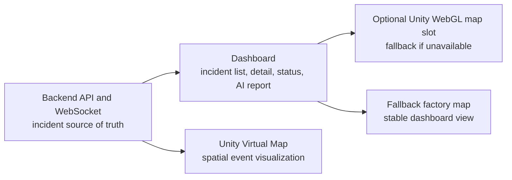
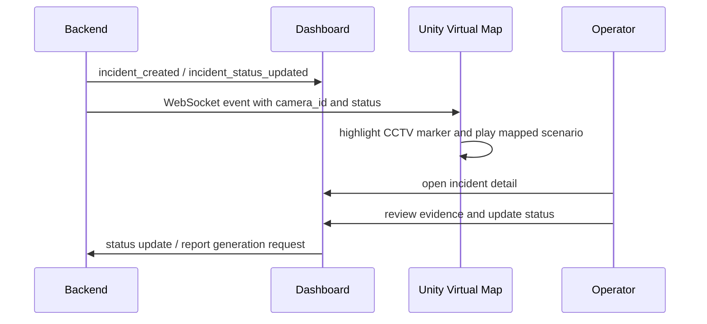

# Architecture Overview

## Responsibility Split

The backend and dashboard state define the incident lifecycle. Unity visualizes where an incident appears in a 3D factory-like space, but it does not decide whether an incident is valid.

## Event Flow

## Why Unity Was Added

The dashboard is effective for lists, evidence, and workflow state, but it does not naturally show spatial relationships such as:

- which CCTV observed the incident,
- where the camera is positioned,
- how a robot or intruder moved through a scene,
- how multiple camera viewpoints relate to a physical area.

Unity was used to prototype this spatial layer. It provides camera movement, CCTV view switching, multi-camera panels, robot/drone scenario playback, and BIM/CAD extension experiments.

## WebGL and Fallback Decision

An embedded Unity WebGL map was investigated, but the high-asset Unity scene made WebGL less reliable for demo recording. Browser memory, build output structure, WebGL runtime initialization, and asset loading risk could break the dashboard map area.

The final demo therefore used:

- Dashboard as the primary review and report UI.
- Unity standalone/editor as the Virtual Map visualization.
- WebSocket events to keep both views aligned.
- A dashboard fallback map for stable frontend operation.

## Scenario Mapping

The demo used camera-centered scenario mapping:

| Camera | Scenario |
| --- | --- |
| `cam_01` | Fence climbing |
| `cam_02` | Fence damage |
| `cam_03` | Facility filming |
| `cam_04` | Facility damage |

This mapping was a demo simplification. In a production system, scenario type, zone, object id, and policy context should come from backend incident data.
