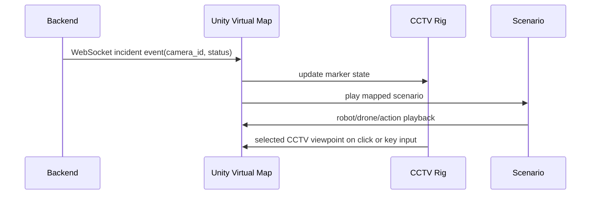

# Unity Virtual Map Source Samples

This folder is the main portfolio section. It contains selected Unity scripts from the Virtual Map simulator prototype used to visualize industrial security incidents in a 3D scene.

The simulator receives backend incident events, maps them to CCTV camera ids, highlights the relevant camera marker, and can play a corresponding demo scenario. The dashboard remains the incident review and report UI; Unity provides the spatial visualization layer.

## Implemented Simulator Features

| Feature | Implementation |
| --- | --- |
| Backend event listener | `SecurityShowcaseController.cs` opens a WebSocket connection and consumes incident events. |
| Camera-based incident mapping | Incoming `camera_id` values select CCTV rigs and mapped demo scenarios. |
| CCTV marker feedback | `SecurityCameraRig.cs` manages normal, detected, and reviewed marker states with ring emphasis. |
| CCTV viewpoint entry | Marker/body click and keyboard controls move the operator into a CCTV-specific view. |
| Four-camera view | The main controller can show `cam_01` to `cam_04` together for demo recording. |
| Operator camera control | `FactoryMapCameraController.cs` supports observation camera pan, orbit, zoom, reset, and focus behavior. |
| Scenario playback | `SecurityScenarioController.cs` coordinates four demo flows: fence climbing, fence damage, facility filming, and facility damage. |
| Robot/drone presentation | Robot, mech, and drone scripts support patrol, attack, filming, and ambient movement. |
| BIM/CAD setup support | Editor tools help generate CCTV rigs from mount points and look targets on imported models. |

## Runtime Flow

## Runtime Scripts

- `SecurityShowcaseController.cs`: Main runtime coordinator for CCTV state, camera selection, backend WebSocket events, demo bridge compatibility, quit/window controls, and CCTV multi-view UI.
- `SecurityScenarioController.cs`: Controls four demo scenarios: fence climbing, fence damage, facility filming, and facility damage.
- `SecurityCameraRig.cs`: CCTV marker state, marker ring, CCTV viewpoint, click handling, and selected-camera view.
- `FactoryMapCameraController.cs`: Operator camera pan, orbit, zoom, reset, and focus controls.
- `SecurityDroneRig.cs`: Drone patrol movement.
- `SecurityPlayerRobotController.cs`: Player robot patrol mode.
- `SecurityMechAttackAdapter.cs`: Mech attack animation, beam, audio, and cannon-cycle adapter.
- `SecurityDashboardContracts.cs`: Serializable payload contracts used by Unity.

## BIM/CAD Extension Scripts

- `Scripts/BIM/BimObjectMetadata.cs`: Metadata component for imported BIM objects.
- `Scripts/BIM/BimMetadataLoader.cs`: Applies extracted IFC/BIM metadata to imported Unity objects.
- `Scripts/BIM/BimZoneAnchor.cs`: Marks zone candidates and review points in the scene.
- `Editor/BIM/BimCctvPlacementAssistant.cs`: Editor tool for semi-automated CCTV placement from mount point and look target.
- `Editor/BIM/BimVirtualMapAutomationWindow.cs`: Editor window for metadata loading, zone anchor generation, CCTV placement, and audit report generation.
- `Tools/BIM/extract_ifc_metadata.py`: Metadata extraction helper for IFC-based experiments.

## Demo Scenario Mapping

| Camera | Demo Scenario | Spatial Purpose |
| --- | --- | --- |
| `cam_01` | Fence climbing | Show perimeter intrusion and CCTV marker detection. |
| `cam_02` | Fence damage | Show attack actor and facility boundary damage. |
| `cam_03` | Facility filming | Show suspicious filming/scan behavior near a target point. |
| `cam_04` | Facility damage | Show facility attack with mech animation/effects. |

This mapping is intentionally simple for demo recording. A production version should use backend-provided scenario type, zone, object id, and policy context instead of camera-only mapping.

## What Is Excluded

This folder is not a complete Unity project. It excludes scenes, prefabs, materials, imported models, Asset Store packages, generated `.meta` files, and build outputs. Those assets are large and may be licensed or environment-specific.

## Safe Defaults

The original working scene used local paths for demo bridge files and local backend URLs. The public copy replaces local absolute bridge paths with a relative placeholder. Before using the code in a real project, configure paths and endpoints through local scene settings or environment-specific configuration.
